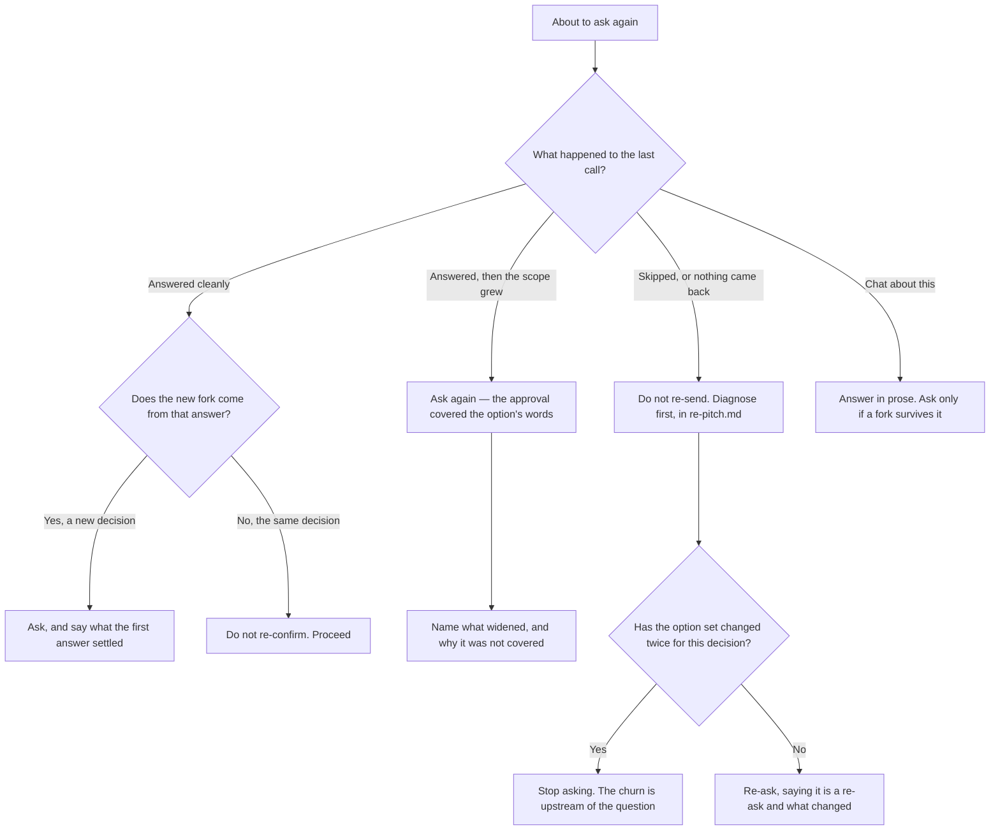

# A run of questions

Open this when you are about to ask a second time inside one piece of work. One
call is a question; several calls are a run, and a run has properties no single
call has — the reader's sense of how long this goes on, what an earlier answer
still authorises, and whether the picture they built two calls ago is still the
picture you are working from.

Everything below turns on what happened to the previous call, because the branches
want opposite fixes. Re-sending repairs a call that was never seen and makes a call
that was skipped worse.

## Say how long this goes on, once, at the start

A reader on the fourth dialog of an unannounced series cannot tell whether to
invest thought here or save it for something later. They do not know whether there
are five more or fifty, and the dialog is the one place they cannot ask.

Say the shape of the run once, early, in prose before the first call: how many
decisions you expect, and what they are about. An unbounded series becomes a known
one for the cost of a sentence.

Then carry the position inside each question, in one clause: `Finding 3 of 11, two
fixed so far.` It costs a few words and it is the difference between a reader
budgeting their attention and a reader rationing it.

## Decide the run's budget before the second call, not during the fifth

Work out how many calls this piece of work is worth, and hold to it. A run that
grows one question at a time is the shape that exhausts a reader, because no single
call ever looks like the one too many.

Where the work needs more decisions than the budget, that is a finding about the
work rather than a licence to keep asking. Take the remaining decisions yourself on
the terms Section 1 of SKILL.md sets out — decide, state the evidence, say what
would change your mind — and put them in prose where the reader can overrule them
cheaply.

## An approval covers what the option said, and nothing more

This is the rule most often lost across a run, because nothing about a clean answer
feels like a boundary.

Quote the chosen option's own words back when you act on it, rather than
paraphrasing. Paraphrase is where a narrow approval quietly becomes a broad one:
`Rebuild now` becomes `rebuild and reindex`, and the reader agreed to the first.

Adjacent work that obviously follows was not approved. Obviousness is your view of
it, and the reader's view is the one that consented. Where the work has grown past
what the option said, that is a new question, and it is a cheap one — name what
widened and why the first answer does not reach it.

## A clean answer can earn a follow-up

`reading-answers.md` says not to re-confirm a decision the reader has already made,
and that is right. It is not a rule against asking anything else.

The two are different acts. Re-confirming asks the same decision twice and spends
the reader's attention on nothing. A follow-up asks a decision the first answer
created — the answer opened a fork that did not exist before, or resolved one
question into a choice inside it. That question is as legitimate as the first, and
withholding it means guessing at something the reader would have settled in one
keystroke.

The test: could you have asked this before their answer? If yes, you are
re-confirming. If no, it is a new fork and it is yours to raise.

## Re-asking the same decision

Say that a re-ask is a re-ask, and what changed. Without that the reader cannot
tell your second attempt from a duplicate, and a duplicate reads as the dialog
having failed rather than as you having listened.

Where the options changed underneath you — because something you learned since
removed one, or added one — say so and say why. A reader who chose from three
options and now sees four different ones has no way to know whether their earlier
thinking still applies.

Stop when the option set has changed twice for the same decision. At that point the
churn is upstream of the question: the thing being decided is not stable, and no
wording fixes a question about a moving target. Go and stabilise it, or decide it
yourself and say so.

## The reader's picture drifts, and yours does not

You have been in this work continuously. The reader has not — they answered one
dialog, went back to something else, and arrived at this one with whatever they
remember. Across a run that gap widens every call.

So each call restates its own anchor: what is being decided and what makes it
matter, in the question text, even when the previous call said it. A clause of
repetition is cheaper than a wrong answer, and the reader cannot scroll back to
check what they were told.

Where a later question depends on an earlier answer, name the answer rather than
alluding to it. `You chose to rebuild the index inside the migration` costs one
clause and removes the reader's need to remember which of two things they picked.
